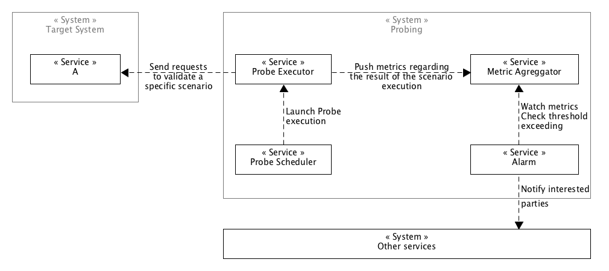

###### SERVICE OPERATIONS
# Generic Probe System

**Version** : 0.1.0-DRAFT

 

## Abstract

This document describe a generic probing system. It details all the building blocks need to build a probing system. The document focuses on the a generic architecture with no emphasis on real vendor products generally used to create probing systems.

Don't worry, at the end we will look at some possible implementations of that architecture on various use cases.
The goal of this document is to give you a general knowledge of the block need to create a probing; to allow you build our own system using either with vendor products or with open source tools or even a mix of two. 

## Contents

  1. [Terminology]
  1. [Proposal]
  1. [Implementations]
  1. [References]

## Terminology

* **Probe** : Is like a sensor of services. It execute a scenario scripts to validate that a service works.
* **Metric** : Is a unit of mesurement that helps capture some information about a system. Regarding a probing system, it helps gather the information about the status of our checks.
* **Alarm** : It's an indication of threshold exceeds regarding  metric definitions.

## Proposal

### Architecture

## Implementations 

### On AWS

### On-Premise with open source tools

[Soon]

## References

[Soon]

[Background]:#background
[Terminology]:#terminology
[Implementations]:#implementations
[Proposal]:#proposal
[References]:#references