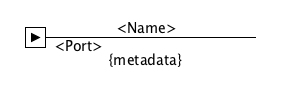

###### SOFTWARE ARCHITECTURE
# SSCC Spec.

**Version** : 0.1.0-draft

 

## Abstract

This document present a diagram model are created to help achitects decribe easily and in more concise manner their architecture. This new model introduce few simple drawings expressing how a global system is architectured. You will be able to described what items your architecture is composed of; going from the global view to a more detail view.

## Contents

  1. [Background]
  1. [Key concepts]
  1. [Examples]

## Background

This architecture model is inspired by the well known [C4-model](http://c4model.com/). As this model, the SSCC model is simple and clear. It focuses on a small problem/scope to address : use simple drwaing to describe small and even complex systems.

UML diagrams are great and it can be used to express almost any software architecture. But it comes with some bottlenecks :

- Diagrams could be hard to remember and complex to use
- Diagrams are often too expressive than they need to be
- The same UML Drawings means different things regarding the type of Diagrams you are using

Quite often, architecture diagrams start with some annotated simple drawings as polygones and lines.
When this is already clear for everyone, we add some complexity by transforming our drawings to UML Diagrams.
Therefore, we tend to loose visibily and clarity.

I'm nothing saying that UML is useless; I think UML specifications are well suited for purposes such as:

- Code generation based on UML Diagrams
- Software Specification documents where things needs to be detailed and accurate

I really believe that architecture diagrams should be :

- Simple and clear
- Readable by either business or technical stakeholders
- Accessible by anybody who wants to express an idea visually

## Notations

The SSCC model use mainly some rectangles to represent almost all drawings. It makes a smart use of annotations to distinguish items within a diagram.

###### MAIN ITEMS

Item | Params | Details | Representation 
---------|------ |-------|---------
System | Name or Context | {metadata} are as kv pairs  givingmore detail on the system |  
Service | Name | {metadata} are as kv pairs  givingmore detail on the system | 
Component | Name | {metadata}  | 
Class | Name | |

 

###### OTHER ITEMS 

Item | Params | Details | Representation 
------|-------|----------|---------
Actor | | | 
Relation | | | 
Connector | | | 
Forwarder | | | 
Listener | | | 
Sender | | | 

## Key concepts

In SSCC model we have 4 main concepts with their associated diagrams : 

- **S**: System Diagram
- **S**: Service Diagram
- **C**: Component Diagram
- **C**: Class Diagram

With those 4 abstract concepts we could architure almost any system. We could also view a system architecture from different angles.
In fact, each diagram gives a specific level of details regarding your architecture. Suppose you are presenting your architecture to specific skateholder type; you need to show them the level of details that is appropriate to them. 

We will look into each diagrams of the SSCC model and also gives you our recommendation on the right target audicance for each diagram. 

 
### System (S)

#### Overview

The **System Diagram** will be your starting point when architecting a software system. It gives a hollistic view of how a global software system is architectured. This global software system is somtimes composed of one or more sub-systems. Moreover, those systems could be either internal or external. 

  > **Internal** : Means, built by you and it is part of your internal infrastructure  
  > **External** : Means, provided by an external company; usually SAAS services or systems out of your infrastructure
  

#### Benefits

using this diagrams have some benefits:

- Put emphasis on the global view of the architecure and its sub-systems
- Identify internal and exrternal systems 
- Identify our key partners; 
- Identify relationships among those systems
- Identify system contracts incompatibilities that could cause integration problems
- Identify logical boundaries in which our systems will operate. (More on [DDD Bounded context](https://codeburst.io/ddd-strategic-patterns-how-to-define-bounded-contexts-2dc70927976e) )

#### Audiance

Looking at this diagram shows all softwarea system diagram of t could be seen as a set of services packed together to solve a specific problem domain. If you have some knowledges about DDD (Domain Driven Design) concepts, the concept of system follows the same idea of a "Bounded Context".
It is a sementic contextual boundaries where each part of a software as a specific meaning and does specific things.

A system diagram look like this : 

## Examples

## Authors & contributors

* Lionel T. ( [@lktslionel](twitter.com/lktslionel) )

## License

Copyright (c) 2017 - lktslionel. All rights reserved.

Licensed under the [MIT](LICENSE) License.

[Background]:         #Background
[Key concepts]:       #Key%20concepts
[Examples]:           #Examples

